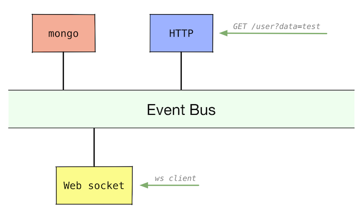

# =realtimer=

**Realtimer** is comprised of 2 modules:
 * *Tracker service*
 * *CLI client*
 

 
The *Tracker* module is a non-blocking REST API one can call to publish events (via GET).

The *CLI client* works as subscriber to an event bus. It is using RxJava, generating a stream of Events (can be filtered, transformed, etc).

**Realtimer** leverages [Vert.x][1] - a distributed event bus backed by a simple concurrency model.
In the simplest scenario one can have one *Tracker service* instance and multiple websocket clients. Clients are fault-tolerant, meaning they operate regardless of whether the *Tracker service* is running or not (clients reconnect automatically 5 sec after the connection is down).

**Realtimer** is scalable. It is containerized (Docker) and can be scaled up in a Kubernetes cluster. Multiple *Tracker* instances (running on different nodes) share the exact-same event bus. This is achieved by using a cluster manager (Apache Ignite is used).

*Tracker* instances are split into two separate modules (HTTP, Web socket) so that they can be scaled independently. Each has its' own load-balancer, forming a distributed, fault-tolerant and highly-available system.

## TO-DO list

## Installation

```
$ git clone https://github.com/maslick/realtimer.git
$ ./gradlew clean build
```

## Usage
#### 1. Tracker

Start the server (tracker):
```
$ java -jar tracker/build/libs/realtimer.jar
```

To fire a single GET request run:
```
$ curl http://localhost:8080/testUserId?data=testData
```

Performance test (using [vegeta][4]):
```
$ echo "GET http://localhost:8080/testUserId?data=testData" | vegeta attack -duration=15s -rate=500 | vegeta report
```

#### 2. CLI client

```
$ java -DuserId=testUserId -jar ws-client/build/libs/realtimer-cli.jar
$ java -DuserId=testUserId -Daddress=ws://localhost:8081 -jar ws-client/build/libs/realtimer-cli.jar
```

#### 3. Web browser client (web-socket)

```
$ open ws-client/html5client.html
```

## High availability cluster (kubernetes)

Build docker images and push them to the Google Container Registry:
```
$ cd tracker && docker build -t pmaslov/realtimer-http:0.1 .
$ cd ../ws-server && docker build -t pmaslov/realtimer-ws:0.1 .
$ cd ../mongo && docker build -t pmaslov/realtimer-db:0.1

$ docker tag pmaslov/realtimer-http:0.1 eu.gcr.io/[PROJECT-ID]/realtimer-http:0.1
$ docker tag pmaslov/realtimer-ws:0.1 eu.gcr.io/[PROJECT-ID]/realtimer-ws:0.1
$ docker tag pmaslov/realtimer-db:0.1 eu.gcr.io/[PROJECT-ID]/realtimer-db:0.1

$ docker push eu.gcr.io/[PROJECT-ID]/realtimer-http:0.1
$ docker push eu.gcr.io/[PROJECT-ID]/realtimer-ws:0.1
$ docker push eu.gcr.io/[PROJECT-ID]/realtimer-db:0.1
``` 

Create and connect to your k8s cluster:
```
$ gcloud container clusters create my-cluster --zone=europe-west3-a --machine-type=n1-highcpu-4 --num-nodes=2
$ gcloud container clusters get-credentials [CLUSTER-NAME] --zone europe-west3-c --project [PROJECT-ID]
```

Deploy k8s configuration to your cluster
```
$ kubectl create -f kuber.yaml
```

Find your service's external IP:
```
$ kubectl get service realtimer-http-service
```

Do some load testing and display the results: 
```
$ echo "GET http://[SERVICE-IP]:[SERVICE-PORT]/testUserId?data=testdata" | vegeta attack -rate=500 -duration=1m | tee results.bin | vegeta report
$ cat results.bin | vegeta report -type="hist[0,50ms,100ms,200ms,300ms,1s,5s]"
  Bucket           #      %       Histogram
  [0s,     50ms]   20488  68.29%  ###################################################
  [50ms,   100ms]  9392   31.31%  #######################
  [100ms,  200ms]  119    0.40%
  [200ms,  300ms]  1      0.00%
  [300ms,  1s]     0      0.00%
  [1s,     5s]     0      0.00%
  [5s,     +Inf]   0      0.00%
$ cat results.bin | vegeta plot > plot.html
$ open plot.html
```

Find your web socket service IP and connect to it from the CLI-client:
```
$ kubectl get service realtimer-ws-service
$ java -DuserId=maslick -Daddress=ws://[WS-SERVICE-IP]:[WS-SERVICE-PORT]/ws -jar ws-client/build/libs/realtimer-cli.jar
```

[1]: https://en.wikipedia.org/wiki/Vert.x
[2]: https://github.com/kubernetes/minikube
[3]: http://gcr.io
[4]: https://github.com/tsenart/vegeta
